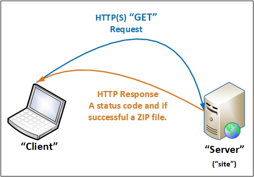
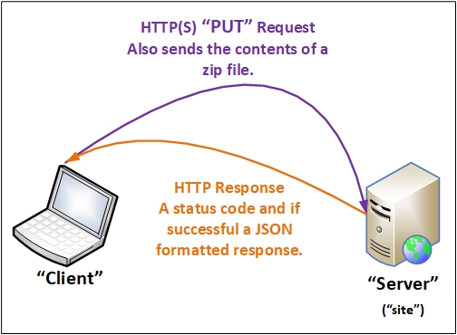
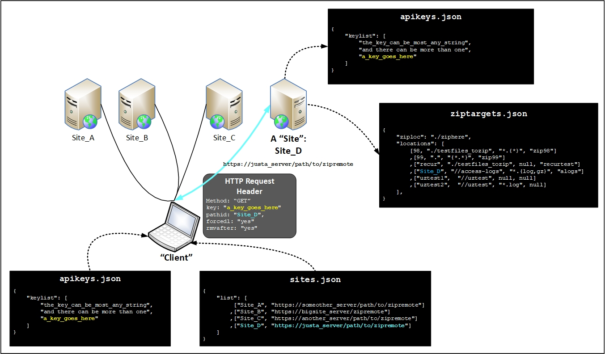
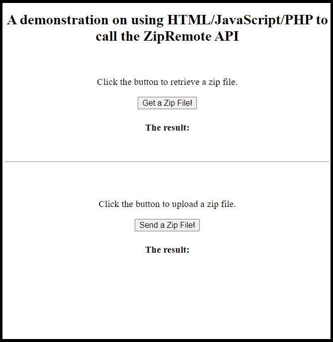
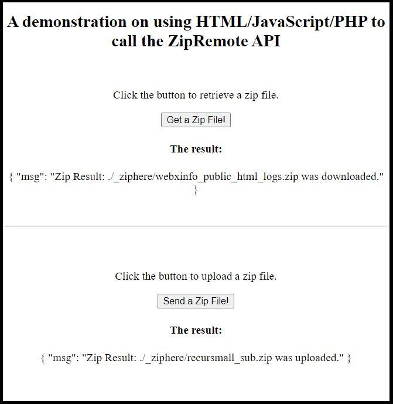

<h1>DRAFT</h1>
**THIS IS A WORK IN PROGRESS! Please be patient, we're almost done!**

**NOTE: Looking for individuals to download and tryout the instructions in the README. If there are any difficulties with the instructions please create an issue.**

# Zip Remote

This repository contains a utility that will zip files within a folder, **or** folder contents recursively on a remote web server and then download them to the client. The utility also has the ability to upload a zip file and optionally extract all or part of its contents.

- [Zip Remote](#zip-remote)
  * [Use Cases](#use-cases)
    + [Advantages](#advantages)
  * [Features](#features)
    + [Configurable](#configurable)
    + [Security](#security)
- [Running The Application](#running-the-application)
  * [Requirements](#requirements)
    + [Server](#server)
    + [PHP Versions](#php-versions)
    + [Apache](#apache)
    + [Site](#site)
    + [Client](#client)
    + [Tools](#tools)
  * [Run!](#run-)
  * [Preparation](#preparation)
    + [Edit Files](#edit-files)
      - [Site](#site-1)
      - [Client](#client-1)
  * [IMPORTANT](#important)
    + [JSON Key File](#json-key-file)
    + [File Locations](#file-locations)
- [Design Details](#design-details)
  * [Overview](#overview)
    + [Download a Zip File](#download-a-zip-file)
    + [Upload a Zip File](#upload-a-zip-file)
    + [Details](#details)
      - [Client and Site Interaction with JSON Files](#client-and-site-interaction-with-json-files)
- [Extras](#extras)
  * [HTML Demonstration Client](#html-demonstration-client)
- [Possible Issues](#possible-issues)
- [Known Issues](#known-issues)
- [The Future](#the-future)

<small><i><a href='http://ecotrust-canada.github.io/markdown-toc/'>Table of contents generated with markdown-toc</a></i></small>

## Use Cases

* **Download server log files**: This is my primary use for this application. I maintain about a dozen servers and I review the logs periodically. I needed *something* to make that task easier and quicker.
* **Backup websites**: This application can *recursively* zip files from a starting location.
* **Distribute Content or Files**: This application can help with the upload and unzip of website or server files. 

### Advantages

Typically I would use an SSH client with SFTP capabilities with a "file explorer" window. But logging in, navigating to the correct folders, downloading the files, and doing that for a dozen sites is tedious and time consuming.

The advantage here is that with a simple PHP script (*see* `client/test_getZipFile.php`) the files can be downloaded (*somewhat securely too*) from all the servers in just a couple of minutes or less.

## Features

There are two parts in this application. The primary part is the **Site** side. It is intended to be installed on an internet accessible server running Apache 2 and PHP V7+.

The second part is the **Client** side and the code provided is more of a demonstration of how to use ZipRemote.

### Configurable

Both *sides* of this application make use JSON files to contain configurations and run-time settings. 

### Security

The security implementation in this application is not the *best*. However it should be sufficient for most use-cases.

**First Level** - This is accomplished on the "site" side by checking the visiting IP address against a list of "approved" IP addresses. **NOTE**: This has been disabled in order to make it easier to get everything running. And later you can add IPs to `ipvalid.json`.

**Second Level** - This is accomplished by the use of a "key" and a "path ID". With those two parameters the client identifies itself and selects a predetermined path and zip operation. 

**Third Level** - When you create the folder to contain the `site` files do not use the name `zipremote` or `site` to contain the `site` files. Make it obscure by using a randomized name.

# Running The Application

Before continuing please review the [Preparation](#preparation) section.

This application only runs when a request is received from a "client". It responds to HTTP GET and PUT requests with HTTP error codes and a JSON formatted response.

## Requirements

### Server

I'm using this application on Linux/cPanel servers.

### PHP Versions

* **Server**: PHP 7.X or newer.
* **Client**: PHP 5.6 or newer.

### Apache

Apache 2.4 or newer is recommended.

### Site

After editing the [Site](#site-1) JSON files copy all files in the `site` folder to a folder on your website's server.

### Client

Edit `/zipremote/client/test_zipremote.php` to match the changes you will make to the [Client](#client-1) JSON files.

### Tools

My primary development environment is in Windows and this what use:

* SSH/SFTP - I use a *free* SSH client from [Bitvise](<https://www.bitvise.com/>).
* Text editor - Your choice
* PC Web server - I use [XAMPP](<https://www.apachefriends.org/index.html>) for running the [HTML Demo Client](#html-demo-client)
* API tester - I use [Postman](<https://www.postman.com/>) for developing and testing  endpoints.

## Run!

At a local command line run this from within the `client` folder - `php ./test_gettZipFile.php`. However you will need to complete the steps in [Preparation](#preparation).

## Preparation

### Edit Files

Prior to running there are some files that will require editing. The files and contents are described in the following sections.

While editing and creating run-time versions of the JSON files feel free to remove the `"comments"` arrays.

#### Site

These files will need to be located on an internet accessible server(*http,https*):

* `.htaccess`
* `example_apikeys.json` - edit (*see below*) and save as `apikeys.json`
* `example_ipvalid.json` - edit (*see below*) and save as `ipvalid.json`
* `example_ziptargets.json` - edit (*see below*) and save as `ziptargets.json`
* `tzone.json`
* `areqheaders.php`
* `configchk.php`
* `index.php`
* `ip_isvalid.php`
* `timezone.php`
* `ziplib.php`

Path in repository: `/site`

* `tzone.json` - Put your timezone in this file. A decent source for this is at <https://en.wikipedia.org/wiki/List_of_tz_database_time_zones>. Find your location and use the string found under the "TZ database name" column.
* `example_ziptargets.json` - Edit this file and save it as `ziptargets.json`.
  * `"ziploc"` - This is where the zip files are created prior to download.
  * `"locations"` - This is a two dimensional array. Each element in `locations[]` contains:
    * index `0` - This is the "path ID" (aka `_PATHID` in `index.php`). It is used by the client to select the zip targets (*path and zip file name*).
    * index `1` - This is the actual path to the file(s) to be zipped (aka `_TARGET` in `index.php`). It can be *relative*, *absolute*, or a sub-folder of `$HOME` on the platform where the site application is held.
    * index `2` - This is the *file pattern* used when zipping is **not** recursive (aka `_FILEPATT` in `index.php`).
    * index `3` - This is is the zip file *name* (aka `_ZIPNAME` in `index.php`). It will be placed in the location specified in `_TARGET`.
* `example_ipvalid.json.json` - Edit this file and save it as `ipvalid.json`.
  * `"list"` - This is a two dimensional array. Each element in `list[]` contains:
    * index `0` - A **Valid** IPV4 address that will be allowed access.
    * index `1` - A *name* associated with the IP address. It is for reference.
* `example_apikeys.json` - Edit this file and save it as `apikeys.json`.
  * `"keylist"` - Each element in `keylist[]` contains a unique string. It is compared to an incoming "key" value from the client. Here is an online utility for generating passwords (*work well as api keys*) - <https://passwordsgenerator.net/>
* `index.php` - There is no required editing before use.
  * `$ipv` - This enables or disables IP validation. By default is disabled. Set it to `true` to enable it after you have IP addresses in `ipvalid.json`.
* `.htaccess`- There is no required editing before use. This file will allow URLs to work without the `.php` extension.

#### Client

These files will need to be *local* and probably running on your PC. This side of the application **should not** be run on an internet accessible server:

* `cfg.json`
* `example_apikeys.json` - edit (*see below*) and save as `apikeys.json`
* `example_sites.json` - edit (*see below*) and save as `sites.json`
* `configchk.php`
* `getsite.php`
* `parseheaders.php`
* `zipremote.php` - contains the `getZipFile()` and `putZipFile()` functions. This is the API used by clients. 
* `test_getZipFile.php`
* `test_putZipFile.php`

Path in repository: `/client`

* `cfg.json` - There is no required editing before use. This file contains:
  * `"ziploc"` - The location where downloaded zip files will be saved.
  * `"dirsep"` - A directory separator character.
  * `"forcedl"` - If `true` the "site" will force a download of the selected zip file.
  * `"rmvafter"` - If `true` the "site" will remove the zip file after it has been force downloaded.
* `example_apikeys.json` - Edit this file and save it as `apikeys.json`. It must be identical to the "site" `apikeys.json` file.
* `example_sites.json` - Edit this file and save it as `sites.json`.
  * `"list"` - This is a two dimensional array. Each element in `list[]` contains:
    * index `0` - Contains an identifier used for selecting the site, it can be a number or a string.
    * index `1` - This is the URL of the "site", including the path to where the site application is stored.
* `test_getZipFile.php` **and** `test_putZipFile.php` - Demonstration code, edit as needed to test your changes.

See [Extras](#extras) for additional files and information.

## IMPORTANT

### JSON Key File

The `apikeys.json` file in the `client` and in `site` are the same file. If you edit one the other **must** be identical. Try to use randomized strings, don't make the keys easy to guess.

### File Locations

The `site` files should be placed in a folder in your servers' `public_html` folder. The name of the containing folder can be anything(almost) and should be referenced in `/client/sites.json`. To obscure the containing folder I like to use a 12 to 16 character string of random letters and numbers. For example:

This site:
`["bigsite", "https://bigsite_server/zipremote"]`

Change to:
`["bigsite", "https://bigsite_server/F7Mh3MRhXEUA"]`

And the `site` files get copied into:
`/home/$USER/pubic_html/F7Mh3MRhXEUA`

Or the equivalent location on your server.

# Design Details

## Overview

### Download a Zip File

  

### Upload a Zip File

  

### Details

#### Client and Site Interaction with JSON Files

  

# Extras

## HTML Demonstration Client

The demonstration client consists of these files:

* `zipremapi.php` - this the ZipRemote API for clients, it communicates with the "site" side.
* `phpapi.js` - API used by the client, it calls `zipremapi.php`.
* `demo.js` - functions used by `demo_zipremote.html`, uses `phpapi.js`.
* `demo_zipremote.html` - just a simple GUI, you can upload or download zip files and see the responses.

The page looks like this - 

  

Click either, or both buttons and if successful:

  

**NOTE**: You will need an HTTP server with PHP>=5.6 *on your local network* for `demo_gsfapi.html`. This will help insure that the intended security remains intact. In addition, you will need to enter your internet-facing IP address into the `site/ipvalid.json` file if you have enabled that security feature.

## Folder Test Tree Generator

A bash script is provided in the `bash-random_folder_tree` sub-module within this repository. It is located at `zipremote/bash-random_folder_tree/randtree.sh`. Copy `randtree.sh` into the `/zipremote/site/testfiles_tozip` folder (*the* `testfiles_tozip` *folder should have been copied onto your server*).

Run `randtree.sh` from there and the test tree will be created in `testfiles_tozip/randtree`.

# Possible Issues

* I have **not** tested where folders or files are symbolically linked. If this causes problems for anyone please create an issue in this repository.
* It's possible that the zip files will be size limited. I'm not sure what that limit is but may be affected by the PHP `memory_limit` setting.
* In addition to the size limit the *maximum run time* should also be considered. Its value is in the PHP `max_execution_time` setting.

# Known Issues

This section will be updated when ever new issues are discovered, but not yet resolved.

# The Future

I would like to create a "manager" front end that uses ZipRemote. It would aid in maintaining multiple servers and keeping them up to date. It may also be possible to tie in Github to obtain content for uploading.

---
